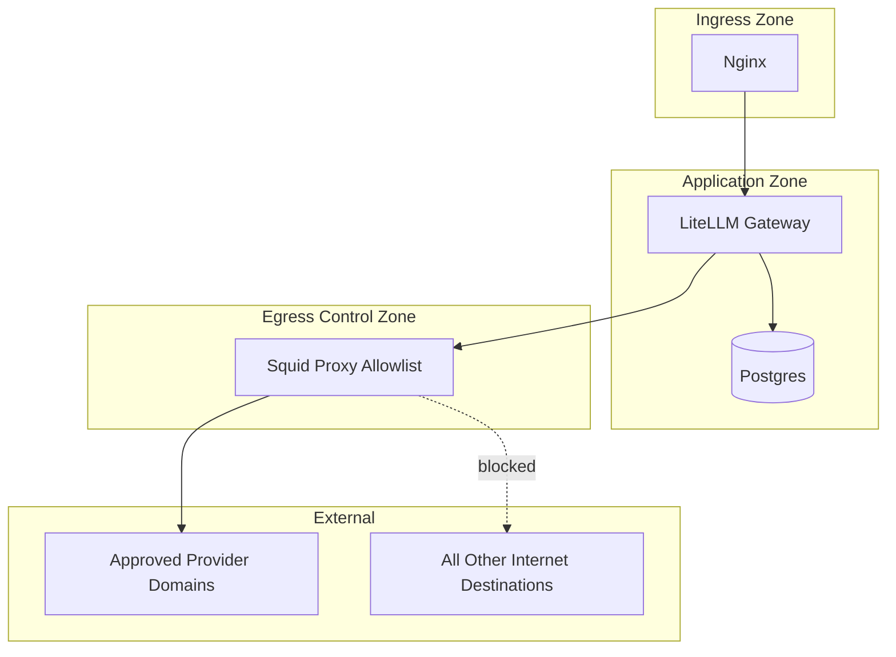

# 🚀 Agent Platform

Provider-agnostic LLM gateway platform for enterprise teams. Friendly, audit-ready, and slightly sarcastic when provoked. 😄

This repository packages a clean control-plane pattern for agentic workloads:

- LiteLLM as the unified OpenAI-compatible gateway
- Nginx as ingress for a single internal endpoint
- Squid as controlled egress for provider allowlisting
- Postgres for gateway state and usage data

It is designed for corporate environments that need centralized model access, usage tracking, and tighter egress governance when evaluating agent frameworks.

## Executive summary

Most agent frameworks can call external APIs, plugins, telemetry endpoints, and webhooks by default. This platform introduces a central LLM gateway and controlled network path so teams can evaluate frameworks with stronger governance.

Primary outcomes:

- 🌐 One LLM endpoint for all internal apps and frameworks
- 📊 Centralized model usage visibility and spend attribution
- 🧭 Centralized model/skill routing and maintenance
- 🔒 Policy-driven outbound access to approved provider domains

## Trust boundaries and traffic policy



## What this platform does

- Gateway: standard OpenAI-compatible interface for multiple model providers via LiteLLM.
- Tracking: central point for model usage and cost observability.
- Skill/model maintenance: single routing config for model naming and deployment mapping.
- Egress governance: explicit allowlist path to approved provider domains.

Fun fact: this gateway won't make coffee yet. Contributions welcome. ☕️

## What this platform does not do by itself

- It does not automatically disable telemetry in every framework or SDK.
- It does not govern third-party connectors/plugins unless your network policy blocks them.
- It does not replace enterprise controls such as IAM, SIEM, DLP, or key management.

## Current repository layout

- `docker-compose.yml`: service composition, networks, health checks
- `ingress/nginx.conf`: ingress routing to `/litellm`
- `egress/squid.conf`: egress allowlist policy
- `litellm/litellm-config.yaml`: LiteLLM model routing configuration

## Quick start

1. Set provider credentials as environment variables (example for Azure):

```bash
export AZURE_API_KEY="<your-azure-api-key>"
export AZURE_API_BASE="https://<your-resource>.cognitiveservices.azure.com"
```

2. Start the stack:

```bash
docker compose up -d
```

3. Verify service health:

```bash
docker compose ps
docker compose logs --tail=100
```

4. Access gateway endpoint:

- `http://localhost/litellm`

## Security model

This repo demonstrates a practical segmentation model aligned with common network-segmentation guidance:

- Ingress and app tiers are separated from controlled egress.
- Outbound model traffic is forced through a policy point.
- Non-allowlisted internet destinations should be denied.

Security claim to use publicly:

- "Provides controlled, provider-approved LLM egress and centralized governance."

Claim to avoid:

- "Guarantees zero data leakage."

## Telemetry and framework caveat

Even with strict provider egress control, agent frameworks may still attempt telemetry, update checks, or connector calls. For production posture, explicitly disable or block non-approved outbound channels.

Recommended baseline:

- Disable framework analytics and optional observability exports unless approved.
- Restrict plugin/node installation and external webhook usage.
- Enforce firewall rules so only approved domains are reachable.
- Periodically review proxy and network logs for drift.

## Provider expansion model

This baseline currently includes an Azure-focused allowlist example in Squid.

To support additional providers:

1. Add provider domains to the Squid allowlist policy.
2. Add provider model routes in `litellm/litellm-config.yaml`.
3. Inject provider credentials via environment variables or secret manager.
4. Validate egress logs before enabling for broader teams.

## Want to collaborate? 🛠️✨

This project is social — open issues, send PRs, or drop suggestions. We're especially interested in:

- Integration recipes for popular agent frameworks (n8n, Rasa, etc.)
- Hardened Squid examples for multi-provider allowlists
- Improved observability dashboards and sample queries

How to contribute:

1. Fork the repo and open a branch for your change.
2. Add tests or example configs where applicable.
3. Open a pull request and describe the security/telemetry implications.

We read every PR, offer constructive feedback, and sometimes respond with GIFs. 🐱‍💻

If you'd like to collaborate privately (enterprise integration, audits, or features), open an issue and tag it `private-collab` and we'll reply with next steps.

## Sponsors 💖

If you'd like to support ongoing work, sponsor the project:

[Sponsor @vimaleshbe on GitHub Sponsors](https://github.com/sponsors/vimaleshbe)

Thanks — your support keeps the CI green and the coffee flowing. ☕️

## Operational guidance

- Keep secrets out of git and out of static config files.
- Use environment variables or enterprise secret managers.
- Maintain a documented domain allowlist change process.
- Add CI secret scanning and dependency scanning before public releases.

## References

- LiteLLM documentation: unified interface and proxy gateway concepts
- Docker Compose documentation: multi-container lifecycle and operations
- Nginx documentation: reverse proxy request handling
- Squid documentation: ACL and access policy directives
- OWASP network segmentation guidance: layered security boundaries

## Disclaimer

This repository is a reference implementation. Final risk posture depends on your enterprise network controls, key lifecycle management, observability policy, and operational discipline.